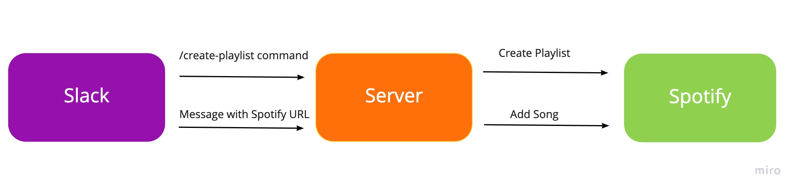
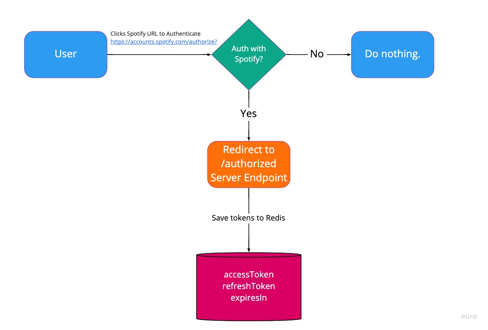
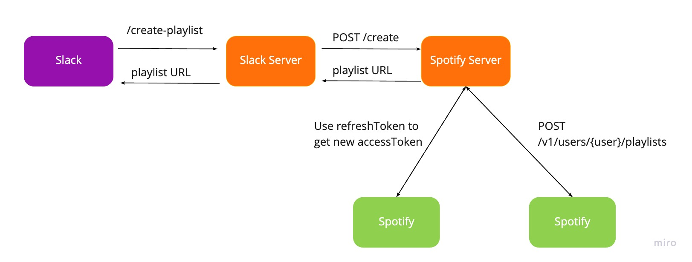
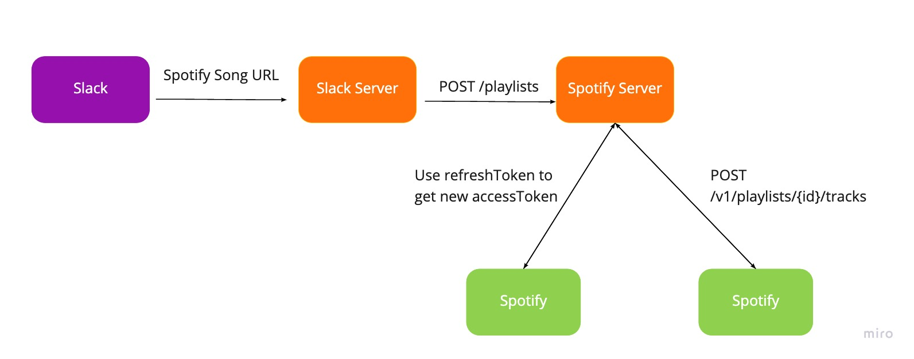

<h1 align="center"> Musicgenius </h1>

<h3 align="center">
Add Spotify Songs Sent via Slack to a Playlist
</h3>

## Setting Up for Local Dev

### Spotify

1. Make a [Spotify](https://www.spotify.com/) account
2. Log in to the [Spotify Developer Dashboard](https://developer.spotify.com/dashboard/login)
3. Click `Create an App`
4. Once you have an app save the `Client ID`, `Client Secret`, and your Spotify username to your `.zshrc` or `.env.development`

   ```
   export SPOTIFY_USER=your-spotify-username
   export SPOTIFY_CLIENT_ID=your-client-id-here
   export SPOTIFY_CLIENT_SECRET=your-client-secret-here
   ```

5. Click `Edit Settings` in the dashboard
6. Add a Redirect URI. Follow the instructions below for setting up `ngrok`. The redirect URI should look like:

   ```
   https://1234abcd.ngrok.io/authorized
   ```

7. Add the `ngrok` url to the `BASE_SERVER_URL` constant in `src/constants.js`
8. Run `yarn start`
9. Run `ngrok` on port `3000`

   ```
   ./ngrok http 3000
   ```

10. Now you should be able to hit any of the REST endpoints using `curl` or `Postman`.

### Slack

1. Create a [Slack](https://slack.com/) account
2. Create a [Slack App](https://api.slack.com/apps). Add it to the appropriate workspace
3. Run the Slack server locally
   `yarn slack`
4. Run `ngrok` on port `4000`

   ```
   ./ngrok http 4000
   ```

5. Once your app is created find your `App Credentials` under the `Basic Information` tab
6. Save the `Signing Secret` in your `.zshrc` or `.env.development` files

   ```
   export SLACK_SIGNING_SECRET=your-slack-signing-secret
   ```

7. Under the `Features` tab, click `Slash Commands`
8. Create a command called `/create-playlist`.
9. Enter the Slack server `ngrok` URL under `Request URL`

   ```
   https//5678efghij.ngrok.io/command
   ```

10. Give it a description, and usage hint
11. Hit save
12. Add this Slack bot to a channel in Slack. Click `More` in the channel details, then click `Add Apps`

### ngrok

1. Download [ngrok](https://ngrok.com/)
2. You can run it by executing it from whatever directory you saved it in.

   ```
   ~/Documents/ngrok http 3000
   ```

3. 3000 is the port number

## How it Works

### Overview



### Authentication



### Creating a Playlist



### Adding a Song


